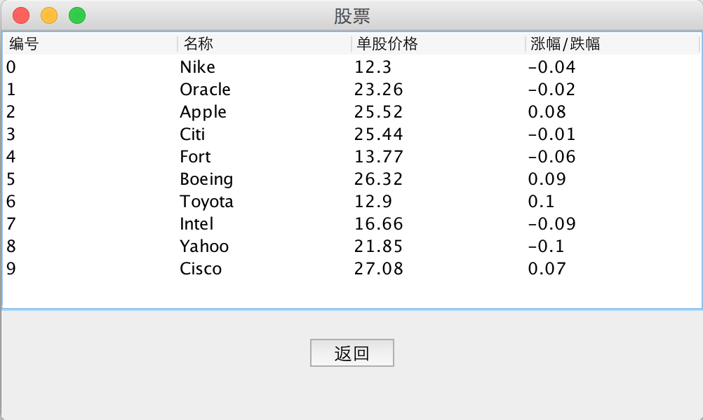
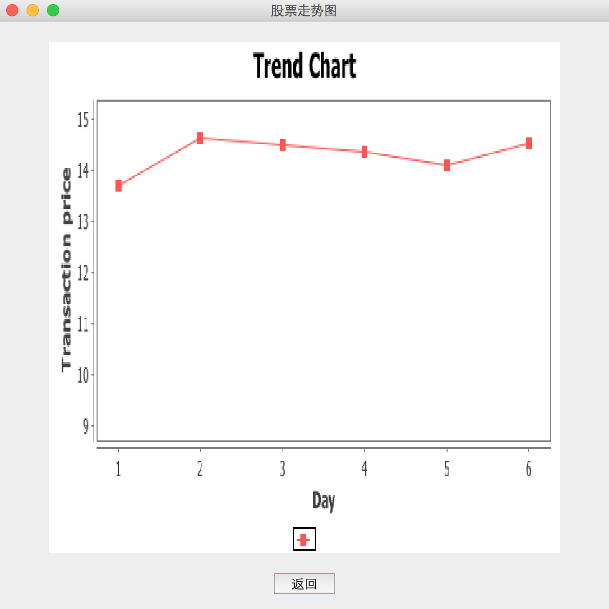

#GUI版大富翁使用说明

##进入游戏

进入游戏后首先需要设置玩家个数(2-4)，之后需要设置游戏天数以及玩家名字，然后就可以进入游戏。

游戏初始设置是玩家每人2000现金，2000存款，100点券。

##游戏过程

###菜单栏

菜单栏位于游戏界面的最上端，从左至右分别是

* 查看
* 道具
* 股票
* 功能

#### 查看

查看菜单中功能有

* 查看玩家信息
* 查看前后指定步数的具体信息
* 查看时间
* 前方10步内预警

#### 道具

道具菜单中功能有

* 使用道具

#### 股票

股票菜单中功能有

* 股票

点击股票后效果如下

双击你想要查看的股票行数，出现股票交易界面，点击最右的走势可以查看股票走势图，效果如下

####功能

功能菜单中功能有

* 认输

###游戏

####掷骰子

点击屏幕中央的骰子，即可进行掷点，骰子最后显示的点数为你前进的步数。

####触发功能点

玩家前进相应步数后会触发功能点事件，玩家完成事件后，进入到下一个玩家的游戏时间。

###游戏结束

游戏结束有两个条件，第一为时间到，资产(现金+存款+房产)最多者获胜。

第二为只剩一位玩家，其余玩家以破产或认输的形式离开游戏。